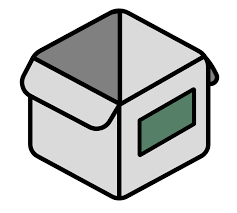

# HomeBox

## 📦 Overview
HomeBox is a self-hosted inventory management platform used for cataloging home and homelab items, components, and assets.

## 🖥️ Deployment
- Created via Proxmox Helper Script: `homebox-ct.sh`
- CT ID: `20602`
- OS / Template: Debian-based LXC template (from script)
- CPU / RAM / Storage: `1 vCPU / 1GB / 4GB`
- Network: Configured via script (bridge and static IP settings)

## 🧰 Services
- Inventory management UI
- API for integrations with Home Assistant or Grafana

## 🚀 Usage
- Access via `http://<ip_address>:7745`
- Add categories, items, and custom fields for tracking

## 🔐 Configuration
- Environment variables and secrets are set via the helper script and `*.vars` files

## 📌 Notes / TODO
- Integrate with Home Assistant sensors
- Enable authentication via Authelia