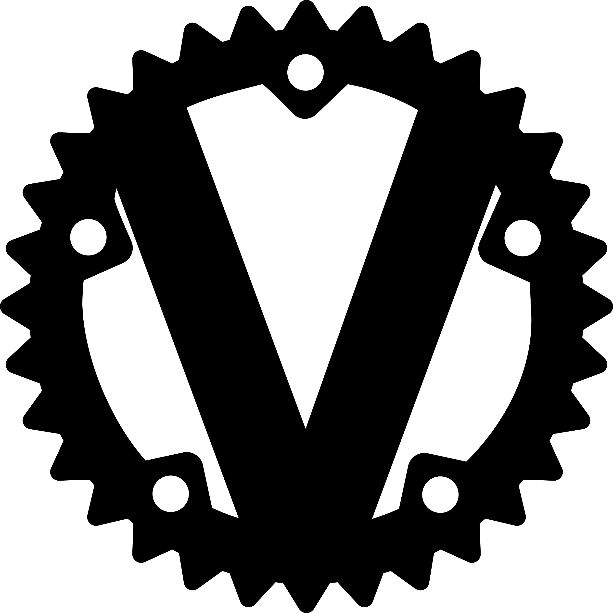

# Vaultwarden

## 📦 Overview
Vaultwarden is a lightweight self-hosted password manager compatible with Bitwarden clients. It provides secure credential storage for the homelab and personal use.

## 🖥️ Deployment
- Created via Proxmox Helper Script: `vaultwarden-ct.sh`
- CT ID: `20002`
- OS / Template: Alpine-based LXC template (from script)
- CPU / RAM / Storage: `1 vCPU / 256MB / 1GB`
- Network: Configured via script (bridge and static IP settings)

## 🧰 Services
- Vaultwarden web vault and API
- Admin portal for user and org management

## 🚀 Usage
- Access via `http://<ip_address>:8000`
- Connect with Bitwarden browser or mobile apps

## 🔐 Configuration
- Environment variables and secrets are set via the helper script and `*.vars` files

## 📌 Notes / TODO
- Add SMTP configuration for password resets
- Enable SSO via Authelia for unified access